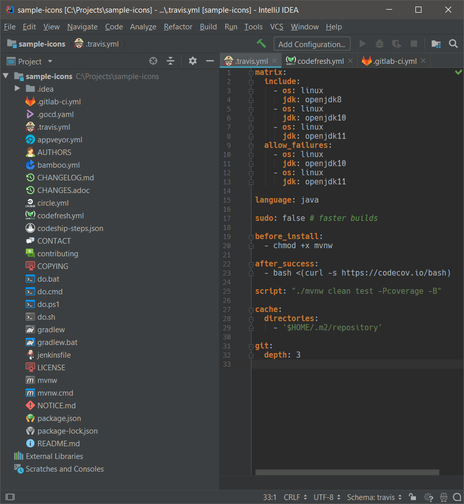
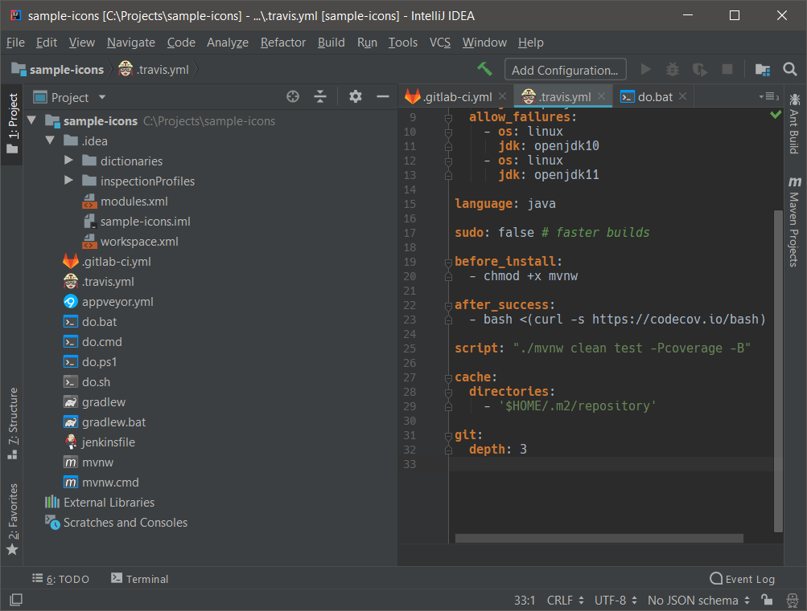
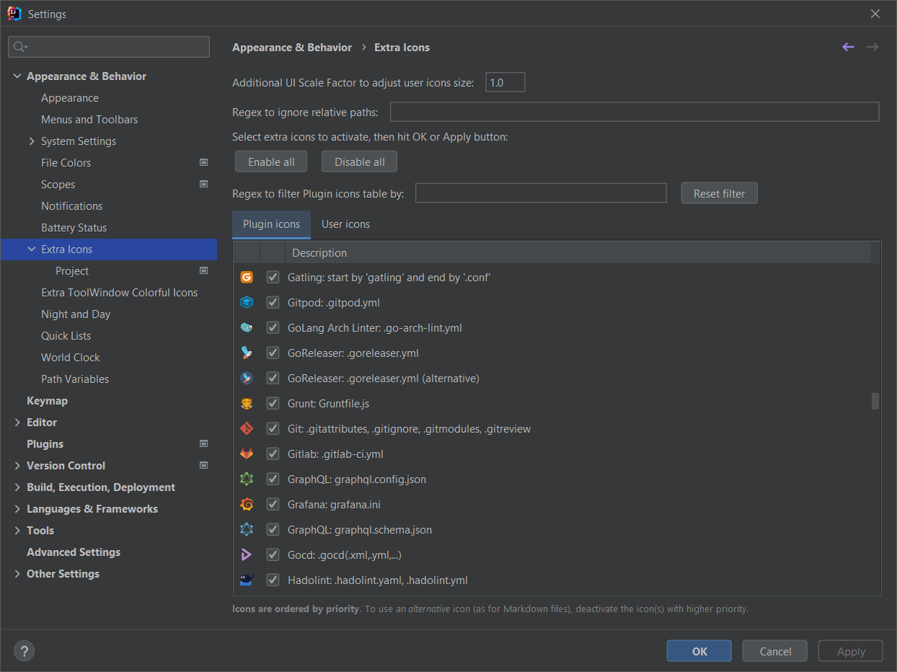

<h1 align="center">
    <a href="https://plugins.jetbrains.com/plugin/11058-extra-icons">
      
    </a><br/>
    Extra Icons
</h1>

<p align="center">
    <a href="https://plugins.jetbrains.com/plugin/11058-extra-icons"></a>
    <a href="https://plugins.jetbrains.com/plugin/11058-extra-icons"></a>
    <a href="https://github.com/jonathanlermitage/intellij-extra-icons-plugin/blob/master/LICENSE.txt"></a>
    <a href="https://github.com/jonathanlermitage/intellij-extra-icons-plugin/graphs/contributors"></a><br>
    <a href="https://github.com/jonathanlermitage/intellij-extra-icons-plugin/actions?query=workflow%3A%22Build%22"></a>
    <a href="https://github.com/jonathanlermitage/intellij-extra-icons-plugin/actions?query=workflow%3A%22Compatibility%22"></a><br>
    <a href="https://github.com/jonathanlermitage/intellij-extra-icons-plugin/actions?query=workflow%3A%22Build+EAP%22"></a>
    <a href="https://github.com/jonathanlermitage/intellij-extra-icons-plugin/actions?query=workflow%3A%22Compatibility+EAP%22"></a>
</p>

Intellij IDEA (Community and Ultimate) plugin that adds icons for files like Travis YML, Appveyor YML, Git sub-modules, etc.  
You can also register your own icons in order to override file icons, but also all [IDE icons](https://jetbrains.design/intellij/resources/icons_list/) (including toolbars, menus, etc.).  
Starting from version 0.4, it works with all JetBrains products like WebStorm, DataGrip, etc.

1. [Download](#download)
2. [Build](#build)  
3. [Contribution](#contribution)  
4. [Known issues](#known-issues)  
5. [License](#license)  
6. [Credits](#credits)  
7. [Screenshots](#screenshots)  

## Download

Download plugin from [JetBrains Plugins Repository](https://plugins.jetbrains.com/plugin/11058-extra-icons) or via your JetBrains IDE (<kbd>File</kbd>, <kbd>Settings</kbd>, <kbd>Plugins</kbd>, <kbd>Marketplace</kbd>).

## Build

Install JDK11+. You should be able to start Gradle Wrapper (`gradlew`). See Gradle commands below. 

### Gradle commands

```bash
$ gradlew buildPlugin        # build plugin to build/distributions/*.zip
$ gradlew runIde             # try plugin in a standalone IDE
$ gradlew dependencyUpdates  # check for dependencies updates
$ gradlew verifyPlugin       # validate plugin.xml descriptors as well as plugin's archive structure
$ gradlew runPluginVerifier  # check for compatibility issues with IDE
$ gradlew test               # run tests
```

Additionally, take a look at the `do` (or `do.cmd` on Windows) script: it contains useful commands to build, run and test the plugin, check for dependencies updates and some maintenance tasks. Show available commands by running `./do help`. 

### Optimizations

Optionally, you may want to install SVGO in order to optimize SVG icons. Install `npm install -g svgo`, then optimize SVG files by running `./do svgo`.

## How to contribute

Please see [CONTRIBUTION.md](CONTRIBUTION.md).

## Known issues

Please see [KNOWN_ISSUES.md](KNOWN_ISSUES.md) and [GitHub open issues](https://github.com/jonathanlermitage/intellij-extra-icons-plugin/issues).

## License

MIT License. In other words, you can do what you want: this project is entirely OpenSource, Free and Gratis.  
You only have to pay a subscription if you want to support my work by using the version that is published to the JetBrains marketplace. If you don't want to (or can't) support my work, you can still use old releases (up to 1.69), or package and install your own release for free.

## 🤝 Contributors

* (author) Jonathan Lermitage (<jonathan.lermitage@gmail.com>)
* Edoardo Luppi (<lp.edoardo@gmail.com>)
* Matthias Kunnen ([github.com/MatthiasKunnen](https://github.com/MatthiasKunnen))
* Florian Böhm ([github.com/Sheigutn](https://github.com/Sheigutn))
* Mateusz Bajorek (<mateusz.bajorek@gmail.com>)
* Bouteiller Alan ([github.com/bouteillerAlan](https://github.com/bouteillerAlan))
* Gaëtan Maisse ([github.com/gaetanmaisse](https://github.com/gaetanmaisse))
* please see the [contributors list](https://github.com/jonathanlermitage/intellij-extra-icons-plugin/graphs/contributors)

## Screenshots






