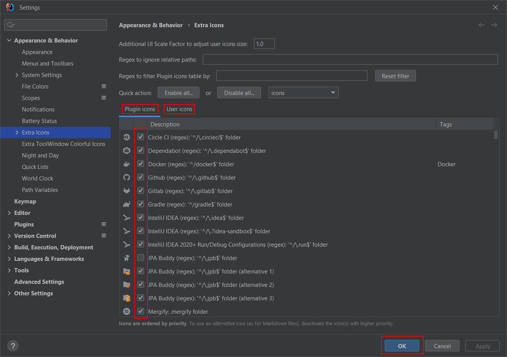
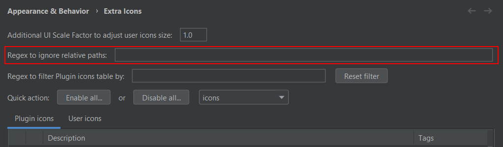
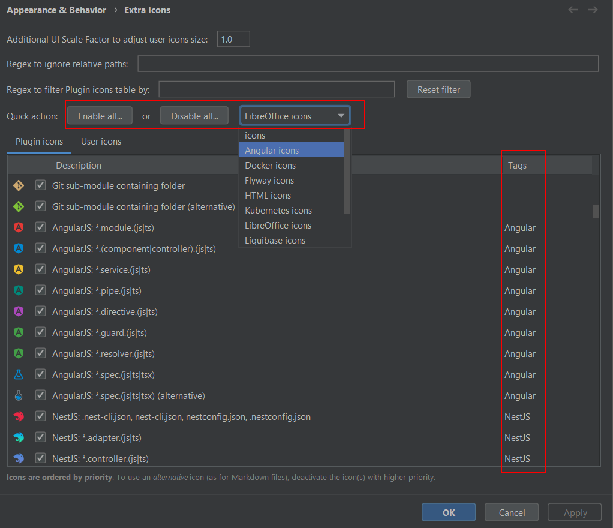
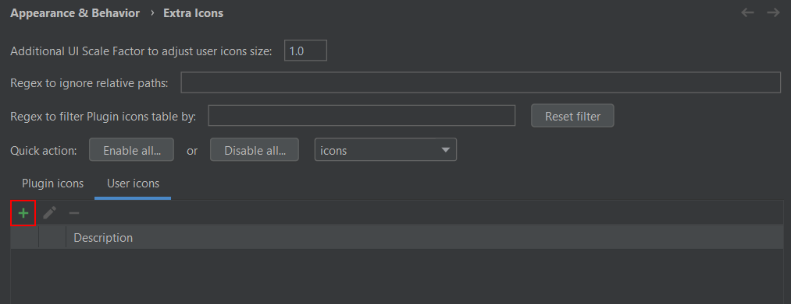
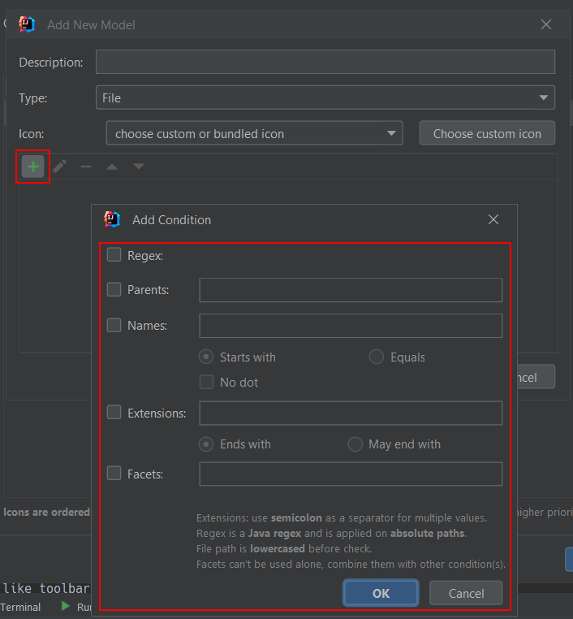
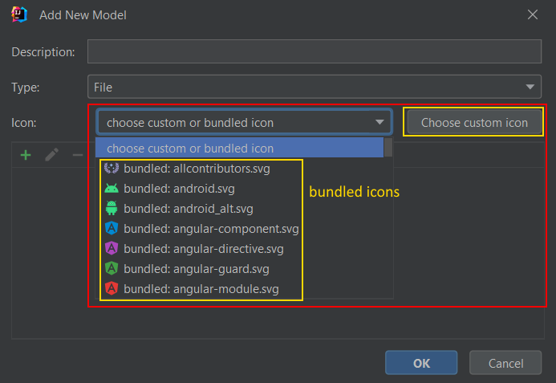
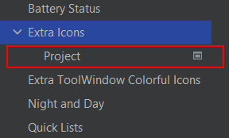
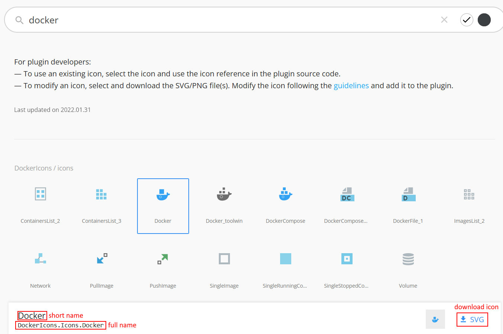

# Get Started

- How to configure the Extra Icons plugin
  - [Enable and disable icons](#enable-and-disable-icons)
  - [Ignore file or folder patterns](#ignore-file-or-folder-patterns)
  - [Quick actions](#quick-actions)
  - [Add your own icons](#add-your-own-icons)
  - [Plugin configuration at the IDE level](#plugin-configuration-at-the-ide-level)
  - [Plugin configuration at the project level](#plugin-configuration-at-the-project-level)
- How to use the Extra Icons plugin
  - [Icons customization by file or folder patterns](#icons-customization-by-file-or-folder-patterns)
  - [IDE icons customization](#ide-icons-customization)
  - [Git sub-modules detection](#git-sub-modules-detection)

## How to configure the Extra Icons plugin

Go to <kbd>File</kbd>, <kbd>Settings...</kbd>, <kbd>Appearance & Behavior</kbd>, <kbd>Extra Icons</kbd>.

### Enable and disable icons

Simply use the checkboxes in the `Plugin icons` and `User icons` tables:  

Changes should take effect on validation. Only icons marked as _IDE icons_ (you will find these icons at the end of the table) are refreshed after IDE restart.

### Ignore file or folder patterns

Declare a single Java regex if you want to deactivate icon customizations for some files and folders:  

The regex is evaluated against files and folders absolute path.

### Quick actions

Some icons are grouped and tagged as Docker icons, Angular icons, etc. You can use a `Quick action` buttons to enable or disable selected tagged icons.  

It will help you to enable and disable some groups of icons quickly. Otherwise, you can still filter the table with a regex (`Regex to filter Plugin icons table by`) in order to find the icons you are looking for, then use the checkboxes.

### Add your own icons

Hit the `+` icon under the `User icons` tab:  

`Description` and `Type` fields: choose a description, and if you will customize a file, a folder or an [IDE icon](#ide-icons-customization).

Add a condition:  

You can activate one or multiple criteria on project's files (it also applies to project's folders): 
- check that file validates a regex
- check that a file has given parent
- check that a file name starts with given expression, is equal to given expression, and optionally doesn't contain a dot (`No dot`)
- check that a file has given extension(s)
- project's module has given facets (you can see facets in Project Structure, Facets). Facet names can be lowercase

Please note all paths are absolute and lowercase.

Per example, if you want to support `HELP.md` and `HELP` files, you will use _Names: Equals_ `help` (remember, file names are lowercase) and _Extensions: May end with_ `.md`. You could also use a regex.

If you want to use your own icon, hit the `Choose custom icon`. It can be a PNG or SVG icon.  
Otherwise, use the dropdown menu to pick a bundled icon.

Please note you can define multiple conditions. Your icon will be applied if at least one of the conditions is verified.

Finally, you will select an icon. This icon can be located on your computer, otherwise you can reuse an icon that comes with Extra Icons:  

### Plugin configuration at the IDE level

By default, configuration applies at IDE level and is shared with all projects.

### Plugin configuration at the project level

You can enable configuration at project level. It will optionally (there is a checkbox) override configuration at IDE level. Project level configuration applies to current project only.  

## How to use the Extra Icons plugin

### Icons customization by file or folder patterns

Files and folders icons are automatically customized on first display, once project has been loaded.  
Performance should be good, even on large projects.

### IDE icons customization

Some icons are marked as _IDE icons_ in the icons list. That means these icons are not detected by file or folder patterns, but by ID. Every icon bundled with the IDE has an ID, and Extra Icons asks the IDE to override these icons by passing their ID.  
IDE icons can be associated to a file type, a folder type, but they can also be GUI icons, like toolbar icons, menu icons, etc. Per example, with IDE icons, you can customize the Java Enum icon, the project folder icon, or the Run icon in the status bar and in the main toolbar.
Please note that IDE icons customization takes effect **after IDE restart**. This is a limitation of the IDE.

If you want to add your own IDE icons overrides, you can find IDE icons and their IDs [here](https://jetbrains.design/intellij/resources/icons_list/). Pick an icon, then copy its (full or short) name, and append `.svg`. Per example, for the `Docker` icon, its full name is `DockerIcons.Icons.Docker.svg`. You can also use its short name `Docker.svg`. The first one is  specific to this icon, the second one will customize all Docker icons (if a `Something.Else.Docker.svg` icon exists, it will be overridden too because it ends with `Docker.vsg`).  

### Git sub-modules detection

If your project defines some git sub-modules, their containing folders icon should be customized. It works with nested sub-modules as well. You should see beautiful Golden or Green Git icons.

Please note sub-modules are detected on project loading (Extra Icons parses `.gitmodules` files only on project's load). If you checkout sub-modules after project's loading (in other words, if you create and populate sub-module folders), you will have to reload your project in order to see sub-module icons.
