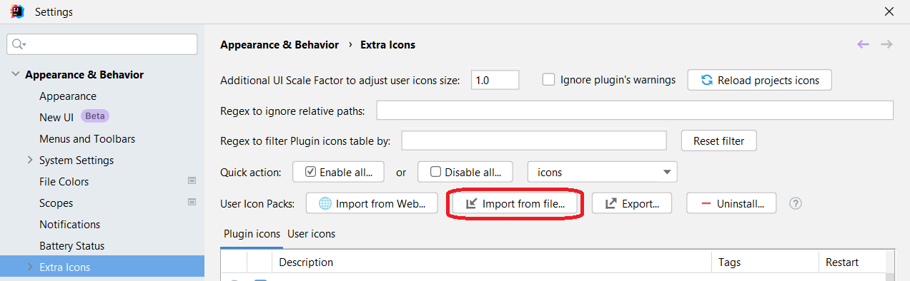
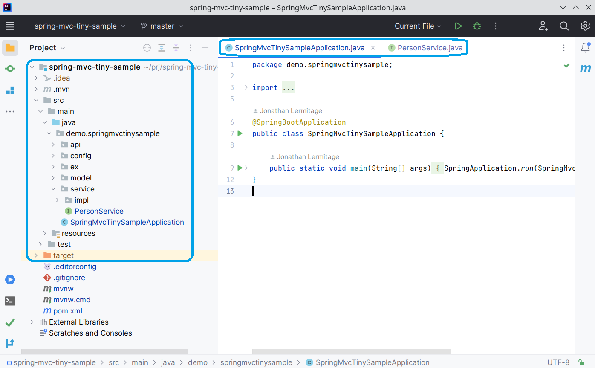

## Downloadable Icon Packs

### How-To

Download a JSON Icon Pack (see Themes below), then go to Extra Icons settings and hit <kbd>Import from file</kbd> button.  

---

### FilesOldUITheme

- download link: [FilesOldUITheme.json](https://raw.githubusercontent.com/jonathanlermitage/intellij-extra-icons-plugin/master/themes/FilesOldUITheme.json)
- nb of icons: <!--FilesOldUITheme_nbOfIcons_start-->104<!--FilesOldUITheme_nbOfIcons_end-->
- designed for: the new UI, light theme
- description: replaces some new UI icons (files and folders) by old UI icons, like Class and Interface files, Package, and Source Root folders... Based on IJ Community icons
- changelog:
  - v15 - 2024/11/29: 1 new icon (pluginJB.svg)
  - v14 - 2024/10/08: 1 new icon (sourceRootFileLayer.svg)
  - v13 - 2024/08/06: 1 new icon (related.svg)
  - v12 - 2024/08/06: 2 new icons (/fileTypes/i18n.svg, pluginLogo.svg)
  - v11 - 2024/07/10: 1 new icon (textArea.svg)
  - v10 - 2024/05/22: 5 new icons
  - v9 - 2024/01/24: 11 new icons
  - v8 - 2023/11/17: 1 new icon (/fileTypes/microsoftWindows.svg)
  - v7 - 2023/08/07: 1 new icon (/fileTypes/uiForm.svg)
  - v6 - 2023/06/14: 1 new icon (/fileTypes/regexp.svg)
  - v5 - 2023/05/09: 8 new icons
  - v4 - 2023/04/28: 1 new icon (webFolder.svg)
  - v3 - 2023/04/18: 1 new icon (/fileTypes/image.svg)
  - v2 - 2023/04/07: 7 new icons
  - v1 - 2023/03/28: initial version, 62 icons

Screenshot (may be outdated):  

---

### AIAssistantTheme

- description: replaces the AI Assistant Star icon with the new coloured Spiral icon

2023/11/28: integrated into [Extra ToolWindow Colorful Icons plugin](https://plugins.jetbrains.com/plugin/16604-extra-toolwindow-colorful-icons/).

---

### JPABuddyOldUITheme

- description: replaces JPA Explorer and JPA Designer gray icons by different and colorful icons

2023/12/06: integrated into [Extra ToolWindow Colorful Icons plugin](https://plugins.jetbrains.com/plugin/16604-extra-toolwindow-colorful-icons/).
