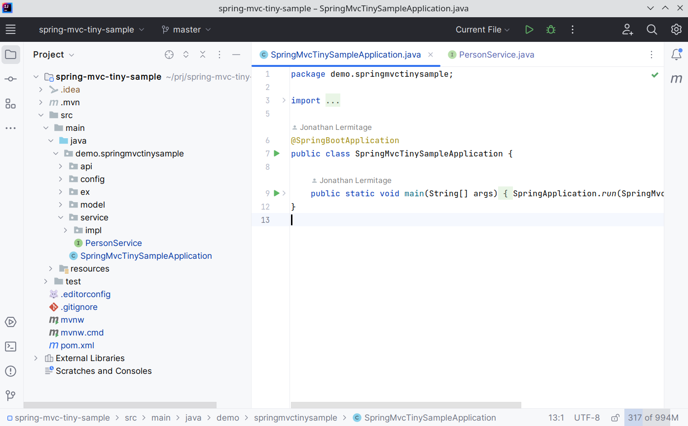

## Downloadable Icon Packs

:warning: *Warning, if you use the new UI: the new UI is a bit buggy. You may have to restart the IDE several times in order to see the new icons. This is totally random. At least, when it fails, it simply doesn't replace icons: the Icon Pack doesn't work, but it won't break your IDE and you will continue to see the regular icons.*  
:warning: *Unfortunately, this is a problem on the JetBrains side, and I can do nothing for now. Sorry for that. **[Up-voting this issue](https://youtrack.jetbrains.com/issue/IDEA-321006/cant-override-IDE-SVG-icons-using-IconPathPatcher-in-newUI) would help**. Thanks!*

### How-To

Download a JSON Icon Pack (see Themes below), then go to Extra Icons settings, and hit <kbd>Import from file</kbd> button.  

---

### NewUIFilesToOldUITheme

- download link: [NewUIFilesToOldUITheme.json](https://raw.githubusercontent.com/jonathanlermitage/intellij-extra-icons-plugin/master/themes/NewUIFilesToOldUITheme.json)
- nb of icons: <!--NewUIFilesToOldUITheme_nbOfIcons_start-->81<!--NewUIFilesToOldUITheme_nbOfIcons_end-->
- designed for: the new UI
- description: it replaces some new UI icons (files and folders) by old UI icons, like Class and Interface files, Package and Source Root folders... Based on IJ Community icons
- changelog:
  - v7 - 2023/08/07: 1 new icon (/fileTypes/uiForm.svg)
  - v6 - 2023/06/14: 1 new icon (/fileTypes/regexp.svg)
  - v5 - 2023/05/09: 8 new icons
  - v4 - 2023/04/28: 1 new icon (webFolder.svg)
  - v3 - 2023/04/18: 1 new icon (/fileTypes/image.svg)
  - v2 - 2023/04/07: 7 new icons
  - v1 - 2023/03/28: initial version, 62 icons

Screenshot (may be outdated):  

---
